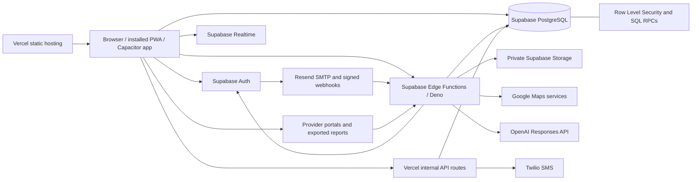

# Field Coach

Field Coach is a private, multi-role field-sales operations platform for lead management, door-to-door field activity, provider sale capture, sales verification, coaching analytics, competition tracking, compensation progress, and accounting review.

- **Product name:** Field Coach
- **Legal operator:** McCoy Platform LLC
- **Current application version:** `1.0.0-beta.2`
- **Web deployment:** `https://mccoy-field-test.vercel.app`
- **Android/iOS application ID:** `com.mccoyplatform.app`

The legal entity and long-lived technical identifiers still use `McCoy` in places such as database objects, event names, storage keys, the repository name, and the native application ID. Those identifiers are intentionally preserved so existing data, Auth links, integrations, and future mobile upgrades continue to refer to the same application.

> [!WARNING]
> Field Coach is still a private beta and is **not release-ready**. The repository contains substantial production-oriented code, but open P0 lead-security and lead-import defects, incomplete provider integrations, unactivated production email delivery, unsigned mobile releases, and unfinished physical-device acceptance remain.

## Documentation scope

This README inventories:

1. The development and deployment stack.
2. The major user-facing capabilities.
3. Every deployable Supabase Edge Function present in `supabase/functions/`.
4. Every Vercel serverless endpoint present in `api/`.
5. Client-referenced backend functions that are missing from source.
6. Known configuration gates and release blockers.

It does **not** enumerate every private JavaScript helper, SQL trigger, SQL RPC, migration helper, or test utility. Those implementation-level functions are numerous and are documented by their source files and regression tests.

## Status legend

| Status | Meaning |
|---|---|
| ✅ Implemented | Source exists and the end-to-end application path is present. |
| ⚠️ Conditional / blocked | Source exists, but external credentials, production activation, a known defect, or release acceptance prevents treating it as complete. |
| 🧪 Pilot / internal | Implemented for controlled testing, evaluation, or internal development operations rather than general production use. |
| ❌ Not implemented | Required backend source or the authoritative integration is absent. |

## Current release status

| Area | Status | Current state |
|---|---|---|
| Web application | ⚠️ Conditional | Deployed on Vercel as a private beta; release acceptance is incomplete. |
| Installable PWA | ✅ Implemented | Manifest and network-first app shell are present. Live Supabase and API traffic bypasses the service-worker cache. |
| Android | 🧪 Internal | Capacitor build path produces an internal debug APK and unsigned AAB; no public signing or Play release is present. |
| iPhone/iPad | ⚠️ Conditional | Capacitor can generate the native Xcode project, but Apple signing, TestFlight, and App Store release are not complete. |
| Lead Pool security | ❌ Release blocker | Open issue #79 documents that the current service-role lead path does not enforce the intended role hierarchy. |
| SPOTIO live-pool behavior | ❌ Release blocker | Open issue #81 documents newest-batch hiding, unstable imported identities, and accumulated duplicates. |
| Provider verification | ⚠️ Partial | Capture, report import, seller-link matching, and reconciliation exist. Direct provider API adapters do not. |
| Production Auth email | ⚠️ Conditional | Resend/Supabase delivery code and observability exist, but verified production SMTP activation remains fail-closed under issue #93. |
| Public v1.0 release | ❌ Not complete | Cross-role security, physical-device acceptance, provider verification, rollback validation, soak testing, signing, tagging, and release remain open under issue #74. |

### Critical open issues

- [Issue #79](https://github.com/phillipbeatty-ctrl/mccoy-field-test/issues/79) — enforce organization, Manager/Trainer, and Rep Lead Pool visibility on every server path.
- [Issue #81](https://github.com/phillipbeatty-ctrl/mccoy-field-test/issues/81) — stop newer SPOTIO uploads from hiding older leads; replace batch/row identity with stable additive upserts and reconcile duplicates safely.
- [Issue #93](https://github.com/phillipbeatty-ctrl/mccoy-field-test/issues/93) — activate verified Resend SMTP, DNS authentication, and signed delivery-webhook observability.
- [Issue #1](https://github.com/phillipbeatty-ctrl/mccoy-field-test/issues/1) — implement direct, authorized provider seller-account verification adapters.
- [Issue #74](https://github.com/phillipbeatty-ctrl/mccoy-field-test/issues/74) — complete the RC1 security, device, verification, rollback, soak, signing, and release gates.

## Architecture



### Request model

- The static client is delivered by Vercel and runs as a framework-free browser application.
- Supabase Auth establishes the user session and provides the JWT used by protected APIs.
- Some low-risk, RLS-protected reads and telemetry inserts use the Supabase browser client directly.
- Privileged operations use Supabase Edge Functions, which validate the JWT, reload the active access record, enforce role and organization checks, and then use the service-role key on the server.
- PostgreSQL is the authoritative operational data store.
- Private files are stored in Supabase Storage and accessed through short-lived signed upload or download URLs.
- Realtime subscriptions refresh selected sales, ranking, and application views.
- Vercel serverless routes are reserved for the internal development queue and Twilio SMS control channel.

## Development stack

| Layer | Technology | Usage |
|---|---|---|
| Web client | HTML5, CSS3, modular vanilla JavaScript | Single-page application composed from `index.html`, `styles.css`, and many focused `app-*.js` modules. No frontend framework or compile-time web bundler is used. |
| Maps | Leaflet `1.9.4`, Leaflet MarkerCluster `1.5.3`, OpenStreetMap tiles | Lead map, clustering, selection, live location, and route/field controls. |
| Address services | Google Maps Services JS `3.4.2` in Edge Functions | Server-side geocoding, exact/place/nearby address matching, and cautious coordinate verification. |
| Backend platform | Supabase | Authentication, PostgreSQL, Realtime, Storage, SQL RPCs, Row Level Security, and Edge Functions. |
| Edge runtime | Deno with npm imports | TypeScript/JavaScript functions under `supabase/functions/`; `deno.json` enables automatic Node module resolution. |
| Database | PostgreSQL managed by Supabase | Organizations, access, users, teams, leads, sessions, events, sales, provider evidence, compensation, accounting, audit, and configuration records. |
| File storage | Private Supabase Storage buckets | Accounting CSV files, production sale-order photos, and the temporary order-photo extraction pilot. |
| Hosting | Vercel | Static web/PWA hosting, security headers, no-store/no-index policy, and internal Node serverless routes in `api/`. |
| Native mobile | Capacitor `8.5.0` | Reproducible Android and iOS project generation from the locally bundled `mobile-web` directory. |
| Android | Capacitor Android `8.5.0`, target SDK 36 | Internal debug APK and unsigned release AAB workflow. |
| iOS/iPadOS | Capacitor iOS `8.5.0` | Xcode project generation; signing and TestFlight remain external release gates. |
| PWA/offline shell | Web App Manifest and service worker | Network-first static shell; Supabase REST, Realtime, Edge Function, and Vercel API requests are never intentionally served from cache. |
| Authentication email | Supabase Auth plus Resend SMTP/webhooks | Confirmation, recovery, resend rate limits, signed delivery events, and Pending Account Access observability. |
| AI extraction | OpenAI Responses API, optional | Suggestion-only order-photo field extraction with strict schemas, sensitive-data blocking, and human confirmation. |
| Accounting delivery | Resend and Microsoft Graph/OneDrive, optional | Audited delivery of private accounting exports when the corresponding credentials are configured. |
| Internal messaging | Twilio `5.10.4` | Signed SMS commands for the private development/test queue. |
| Tests | Node.js built-in test runner | Logic, contract, source, branding, mobile, import, sales, Auth, and layout regression tests. |
| CI | GitHub Actions | Regression gates, production Auth configuration, branding controls, Android artifact builds, and feature-specific checks. |
| JavaScript runtime | Node.js 22+ | Repository scripts, tests, Capacitor preparation, artifact verification, and Vercel serverless functions. |

## Repository layout

| Path | Purpose |
|---|---|
| `index.html`, `styles.css` | Main browser shell and shared styling. |
| `app-*.js` | Modular client capabilities for Auth, sessions, leads, maps, sales, metrics, accounting, and administration. |
| `supabase/migrations/` | Database schema, policies, RPCs, triggers, storage buckets, audit trails, and data migrations. |
| `supabase/functions/` | Deployable Supabase Edge Functions and shared server modules. |
| `api/` | Internal Vercel Node serverless functions for the development queue and Twilio. |
| `scripts/` | Mobile web packaging, native project configuration, release doctor, Auth email setup, and branding scripts. |
| `.github/workflows/` | CI, regression, mobile build, production configuration, and controlled recovery workflows. |
| `manifest.webmanifest`, `service-worker.js`, `offline.html` | PWA identity, app-shell caching, and offline response. |
| `capacitor.config.json` | Stable mobile application identity and local web-bundle configuration. |
| `APP_RELEASE.md` | Mobile/web release state and remaining external gates. |
| `docs/` | Production email and release documentation. |
| `*.test.mjs` | Node regression and contract tests. |

## Local development

### Requirements

- Node.js 22 or newer
- npm
- Python 3 or another local HTTPS/HTTP static server
- Supabase/Vercel credentials only when testing server-side deployment paths

### Install dependencies

```bash
npm install
```

### Serve the browser application

Do not rely on `file://` for normal testing. Auth redirects, service workers, browser security policy, and geolocation behave more accurately through a web origin.

```bash
python3 -m http.server 8080
```

Windows alternative:

```powershell
py -m http.server 8080
```

Then open:

```text
http://localhost:8080
```

Production and meaningful mobile geolocation testing should use HTTPS.

### Run tests

Run the repository's Node test discovery:

```bash
node --test
```

Run the dedicated mobile/branding gate:

```bash
npm run test:mobile
```

### Mobile preparation

```bash
npm run mobile:web
npm run mobile:doctor
npm run mobile:android:prepare
npm run mobile:ios:prepare
```

> [!CAUTION]
> The Android and iOS preparation scripts delete and regenerate the corresponding native project directory before applying repository configuration. Commit or preserve intentional native changes before running them.

## Authentication and authorization

### Browser identity

The browser initializes `@supabase/supabase-js` with the project URL and a **publishable/anonymous key**. That key identifies the Supabase project; it is not a privileged secret and must never be treated as the authorization boundary.

The browser stores the Supabase user session using the SDK's normal client-session behavior. The application uses `getUser()` and Auth state events to determine whether a valid session exists.

### Signup and access flow

1. A user signs up with email and password through Supabase Auth.
2. Supabase Auth sends an email-confirmation link to the custom confirmation page.
3. The confirmation page completes the token/code exchange and records a confirmation audit event.
4. A confirmed user requests application access through `rep-onboarding`.
5. An Admin reviews the request and assigns the user's role, team, region, Manager/Admin chain, display name, and sales classification.
6. The application loads the user's active `app_user_access` record before exposing role-specific pages.
7. Protected Edge Functions validate the current JWT again and reload access/organization data before acting.

A valid Supabase Auth account alone is not sufficient. The account must also have an active application-access record.

### Roles

| Role | Intended authority |
|---|---|
| Admin | Organization-wide user, assignment, lead, sales-review, metrics, compensation, accounting, and configuration controls. |
| Manager | Assigned team/rep supervision and Manager-scoped lead and coaching functions. |
| Trainer | Manager-equivalent field authority for assigned trainees/reps. |
| Rep | Assigned leads, field sessions, door workflow, provider sale capture, and own sales/metrics. |
| Tester | Restricted test/field identity, including the controlled Ghost benchmark behavior where specifically authorized. |
| Accounting | Authorized accounting/customer-list reads and exports without general Admin mutation authority. |

Trainee and Experienced are sales classifications, not separate lead-access roles.

### Password recovery and account switching

- Password reset uses Supabase Auth recovery links and `updateUser()` after a valid recovery session.
- Confirmation and recovery token/code formats are handled by the custom Auth pages.
- Account switching signs out the current Supabase session before a different user authenticates.
- Pending Account Access gives Admins an organization-scoped view of unconfirmed, unapproved, or inactive users.

### Authentication email delivery

The production design is:

```text
Supabase Auth
    -> verified Resend SMTP sender
    -> custom Field Coach confirmation/recovery page
    -> signed Resend/Svix webhook
    -> auth_email_delivery_events
    -> Pending Account Access status
```

The system distinguishes:

- request accepted by Supabase Auth,
- provider acceptance,
- delivery,
- delay,
- bounce,
- complaint,
- open/click events when reported,
- authenticated confirmation completion.

Public resend responses do not reveal whether an address exists. Per-email and per-IP rate limits are enforced. Production confirmation sending remains fail-closed until the verified sender domain, SPF/DKIM/DMARC, secrets, production redirects, and signed webhook are active.

### Server-side authorization

- Edge Functions receive the browser's bearer JWT.
- They call `auth.getUser(jwt)` to validate it.
- They load `app_user_access` and, where applicable, the organization-scoped `users` profile.
- Privileged database work uses `SUPABASE_SERVICE_ROLE_KEY` only inside the Edge/Vercel runtime.
- Organization IDs, active flags, roles, ownership, assignment chains, and target-record relationships are checked server-side.
- SQL functions, tables, history records, and Storage objects use Row Level Security and explicit grants where defined by migrations.

> [!IMPORTANT]
> The current `lead-admin/list_real_leads` implementation is a known exception: because it uses the service-role client without applying the intended role-assignment scope, it bypasses the otherwise hierarchical lead RLS behavior. This is the P0 security defect tracked in issue #79 and must be fixed on every related lead read/action path before release.

### Privacy and version gate

Before a tracked field session can start, the client requires:

- acceptance of the current precise-location and field-analytics notice,
- a matching `privacy_acceptances` record,
- a client version accepted by the server-controlled `app_config` minimum-version gate.

The server remains authoritative for proprietary analytics and session-control rules.

## Data storage and data flow

### PostgreSQL is authoritative

Operational records live in Supabase PostgreSQL. Major table groups include:

| Domain | Representative records |
|---|---|
| Organization and access | `organizations`, `organization_memberships`, `app_user_access`, `users`, `teams`, access requests, secondary Admin assignments, and display-name/account-removal audit. |
| Leads and imports | `leads`, `spotio_import_batches`, `spotio_import_items`, assignment data, activities, door visits, contact-edit history, duplicate/removal audit, and geocode verification history. |
| Field telemetry | `test_sessions`, `test_events`, area assignments, observed door models, session auto-closures, privacy acceptances, and analytics results. |
| Sales | `provider_sale_captures`, `sales_records`, sales-to-complete history, Admin review transactions, credit/reassignment history, ranking-credit history, and customer-list access audit. |
| Provider evidence | `provider_sales_imports`, `provider_sales_rows`, `provider_seller_links`, corporate access, cross-reference results, and provider evidence review history. |
| Compensation | `compensation_rules`, per-user classifications, Manager/Rep override controls, visibility settings, and compensation snapshots stored with sales. |
| Accounting | accounting-access records, private export metadata, delivery attempts, and access logs. |
| Auth email | `auth_email_provider_settings` and `auth_email_delivery_events`. |
| Internal development | `mccoy_dev_queue` and `mccoy_sms_audit`. |

The database schema is migration-driven. Mutations that affect identity, credit, removal, provider evidence, compensation, or access generally preserve a separate audit/history record rather than silently overwriting the only copy of the prior state.

### Direct browser access versus protected APIs

The browser performs selected RLS-controlled operations directly, including session/event telemetry and specific UI reads. Operations requiring broader authority, service credentials, external APIs, or cross-record validation go through Edge Functions.

The service-role key is never supposed to be present in the browser bundle. It belongs only in Supabase, Vercel, or protected CI secret stores.

### Private Storage

| Bucket | Visibility | Purpose |
|---|---|---|
| `accounting-records` | Private | Generated accounting CSV exports. |
| `sale-order-photos` | Private | Photos attached to production sales for extraction and review. |
| `sale-order-photo-pilot` | Private | Temporary, redacted Admin pilot samples used to measure extraction accuracy. |

Uploads and reads use signed URLs with limited lifetimes. File metadata, ownership, organization, extraction state, review state, and audit data remain in PostgreSQL.

### Browser and offline storage

Browser memory and `localStorage` are used only for short-lived UI continuity, selected local preferences, pending handoffs, and cached non-authoritative interface data. They are not the authoritative store for leads, assignments, sales, compensation, or access.

The service worker caches the static application shell with a network-first strategy. It explicitly bypasses:

- Supabase REST and Auth traffic,
- Supabase Realtime/WebSocket traffic,
- Supabase Edge Functions,
- Vercel `/api/` routes.

This prevents stale cached API responses from masquerading as current operational data.

### Realtime updates

Supabase Realtime subscriptions and application events refresh selected ranking, live-win, customer-list, sale, and UI state. Realtime improves responsiveness; it does not replace authorization checks or the PostgreSQL source of truth.

### Location and telemetry

With consent, the client records session starts/ends, GPS fixes, breadcrumbs, door arrivals, dispositions, dwell, transitions, and related context. Server-side analytics can derive movement, GPS quality, door-zone behavior, proximity, stops, field pacing, and coaching flags.

These values are operational coaching signals. They are not precise indoor positioning and should not be treated as standalone proof of misconduct.

## Supabase Edge Function inventory

There are **27 deployable Edge Function directories** in the documented source snapshot.

| Function | Access | Description | Status |
|---|---|---|---|
| `accounting-records` | Admin/Accounting, role-scoped | Produces customer-list and accounting views, creates private CSV exports, records access/delivery audit, and can deliver through Resend or OneDrive. | ⚠️ Delivery channels require credentials. |
| `accounting-sales` | Admin/Accounting | Legacy/compatibility JSON and CSV sales-ledger export. | ✅ Implemented |
| `admin-session-history` | Admin | Returns organization-scoped daily field-session history, Pacific-time windows, durations, activity summaries, and termination reasons. | ✅ Implemented |
| `auth-email-confirmed` | Authenticated user | Records that the authenticated user completed email ownership confirmation. | ✅ Implemented |
| `auth-email-provider-webhook` | Signed provider webhook | Validates Resend/Svix signatures and stores provider delivery, delay, bounce, complaint, open, and click events. | ⚠️ Requires production webhook activation. |
| `auth-email-resend` | Public, rate-limited | Requests a fresh signup confirmation without revealing account existence; fails closed unless production SMTP is ready. | ⚠️ Production sender not activated. |
| `auth-email-status` | Public safe status | Reports production SMTP, redirect, and webhook readiness without exposing secrets. | ✅ Implemented |
| `company-leaders` | Authenticated | Compatibility endpoint that delegates authoritative ranking calculations to the verified-sales ranking RPC. | ✅ Implemented |
| `compensation-settings` | Admin/Accounting | Reads active rules and lets Admins manage thresholds, Manager/Rep override controls, classifications, and assignment-related compensation settings. | ✅ Implemented |
| `field-analytics` | Admin/Manager/Trainer | Analyzes GPS quality, movement, walking speed, stops, door-zone dwell, property proximity, learned door positions, spacing, and coaching flags. | ✅ Implemented |
| `lead-admin` | Action-dependent field/Admin/Manager access | Lists live leads, supplies ownership data, assigns leads, creates addresses, reports/removes duplicates, and archives leads. | ❌ Open P0 scope and live-pool defects (#79, #81). |
| `lead-field-actions` | Active field roles | Gets a lead, edits customer/contact details with audit history, matches an existing service address, or creates and Google-geocodes a field lead. | ⚠️ Google path requires a key. |
| `lead-geocode` | Admin | Claims leads for Google verification, applies trusted rooftop decisions, preserves trusted existing coordinates, and sends ambiguous/conflicting results to review. | ⚠️ Requires Google Maps key. |
| `lead-map-address-search` | Active field roles | Centers the map and matches an address by organization-exact address, Google Place ID, or nearby same street number. | ⚠️ Google fallback requires a key. |
| `metrics-visibility` | Admin | Controls global and per-user visibility of Rep and Manager coaching metrics; Admin metrics remain available to Admin. | ✅ Implemented |
| `pay-progress` | Active user | Calculates current Pacific-week verified eligible sales, production tiers, and estimated commission progress. Explicitly excludes several overrides, add-ons, and chargebacks. | ✅ Implemented estimate |
| `pending-account-access` | Admin | Lists unconfirmed/unapproved/inactive organization accounts, joins latest email delivery state, and requests rate-limited confirmation resends. | ⚠️ Resend requires production SMTP. |
| `provider-reconcile` | Authenticated; dealer import Admin-only | Imports rep/dealer reports, parses supported CSV/HTML-table evidence, excludes abandoned rows, cross-references seller identities, and updates verification/ranking/cancellation state. | ✅ Implemented report workflow |
| `provider-sale-capture` | Active user | Starts one authoritative provider attempt, binds it to the organization/user and optional session/lead/door visit, records return, lists attempts, and abandons incomplete attempts. | ✅ Implemented |
| `rep-coach-summary` | Visibility-scoped user/Manager/Admin | Returns the latest or selected session's doors, contacts, sales, GPS, movement, dwell, transition, and auto-stop summary. | ✅ Implemented |
| `rep-onboarding` | Public/authenticated/Admin by action | Handles signup status, access requests, pending requests, user/role/team/region administration, and hierarchy assignments. | ✅ Implemented |
| `sale-approvals` | Admin | Lists and approves/rejects outside-system or phone sales before they receive eligible verified credit. | ✅ Implemented |
| `sale-order-photo-pilot` | Admin | Runs a private 30–50 sample redacted screenshot pilot, optional AI extraction, independent ground truth, scoring, sensitive-data blocking, and expiry cleanup. | 🧪 Pilot |
| `sale-order-photo` | Sale owner/Admin | Creates signed uploads, lists private sale photos, runs suggestion-only extraction, stores human confirmation, and supports Admin review. | ⚠️ AI step requires OpenAI key. |
| `sale-submit` | Active user | Idempotently converts an open provider capture into a sale record, preserves field/phone context, stores informational distance, and creates pending evidence/accounting state. | ✅ Implemented |
| `session-control` | Active session owner | Performs manual stop and server-side auto-stop after configured outside-area grace or stationary post-disposition limits. | ✅ Implemented |
| `spotio-import` | Authenticated import workflow | Normalizes chunked SPOTIO API, DOM, and CSV records; preserves source evidence; creates/upserts leads; and assigns map-review coordinates where source coordinates are missing. | ❌ Implemented code with open P0 identity/live-pool defects (#81). |

## Vercel serverless API inventory

These routes are internal development operations, not normal field-user APIs.

| Route/module | Description | Status |
|---|---|---|
| `api/dev-queue.mjs` | Internal-token API to list, enqueue, and update development/test queue items stored in Supabase. | 🧪 Internal |
| `api/dev-notify.mjs` | Sends a Twilio message for the newest test-ready queue item and records the outbound audit. | 🧪 Internal; requires Twilio. |
| `api/sms-command.mjs` | Validates the Twilio signature and authorized sender, then applies `PASS`, `FAIL`, `RETEST`, `BUILD NEXT`, `PAUSE DEV`, or `NOTE`. | 🧪 Internal; requires Twilio. |
| `api/_lib.mjs` | Shared environment, service-role database, audit, queue, and SMS-command helpers. | ✅ Shared module |

## User-facing capability inventory

### Accounts, access, and platform

| Capability | Description | Status |
|---|---|---|
| Field Coach branding | User-facing web, PWA, Android, iOS configuration, Auth pages, and release artifacts use Field Coach while stable legal/technical IDs remain unchanged. | ✅ Implemented |
| Email/password Auth | Signup, login, logout, account switching, email confirmation, password recovery, and recovery-session password update. | ✅ Implemented |
| Access approval | Confirmed users request access; Admin assigns role, team, region, Manager/Admin chain, display name, and sales classification. | ✅ Implemented |
| Pending Account Access | Admin visibility into confirmation, access, and provider-delivery state with resend controls. | ⚠️ Resend activation pending. |
| User administration | Admin user listing, display-name control, role/team assignment, hierarchy management, account removal, and audit history. | ✅ Implemented |
| Secondary Admin controls | Owner-authorized secondary Admin assignment and audit-backed authority. | ✅ Implemented |
| Privacy/location consent | Versioned precise-location and analytics consent stored before tracked sessions. | ✅ Implemented |
| Minimum-version gate | Server-controlled client-version requirement prevents obsolete copied builds from starting valid field sessions. | ✅ Implemented |
| PWA install/offline shell | Install manifest, icons, service worker, and offline page. | ✅ Implemented |
| Android native package | Local web bundle, Capacitor project generation, Android permissions/configuration, debug APK, and unsigned AAB CI artifact. | 🧪 Internal beta |
| iPhone/iPad native project | Local web bundle and deterministic Capacitor/Xcode project generation. | ⚠️ Signing/TestFlight incomplete. |

### Leads, maps, and field operations

| Capability | Description | Status |
|---|---|---|
| Lead Pool and map | Real lead loading, search/filter, markers/clusters, ownership, detail panels, manual map control, and refresh. | ❌ P0 security/live-pool blockers. |
| Hierarchical lead visibility | Intended Admin -> Manager/Trainer -> Rep visibility and assignment chain. | ❌ Not correctly enforced on all service-role paths; issue #79. |
| Lead assignment | Admin and Manager/Trainer assignment workflows with hierarchy checks for several actions. | ⚠️ Must be revalidated after #79 repair. |
| SPOTIO import | Browser capture/CSV/API evidence upload, chunking, normalization, preservation, and database load. | ❌ P0 identity/newest-batch repair required; issue #81. |
| Stable additive lead identity | Existing leads should survive later partial uploads, update in place, and preserve assignments/history. | ❌ Not complete; issue #81. |
| Duplicate/archive tooling | Read-only duplicate status, snapshot-checked duplicate archival, individual archival, and removal audit. | ⚠️ Tooling exists; historical reconciliation remains required. |
| Field-created leads | Active field roles can match an existing organization address or create a new lead with audited contact data and Google coordinates. | ⚠️ Google key required for new unmatched addresses. |
| Contact editing | Customer name, phone, and notes updates with before/after audit history. | ✅ Implemented |
| Google coordinate verification | Admin queue applies trusted rooftop results and preserves or reviews uncertain results. | ⚠️ Google key and Admin review required. |
| Address/map search | Exact organization address, Place ID, and nearby same-number matching. | ⚠️ Google fallback requires key. |
| Field sessions | Start/stop, consent/version check, current session, heartbeat, GPS watch, telemetry, stale-session handling, and server auto-stop. | ✅ Implemented |
| Door workflow | Assigned/typed address selection, closest-lead assistance, arrival, dwell timer, activity, visit result, stage, and sale handoff. | ✅ Implemented |
| Lead dispositions | Activity logging plus visit/stage-based pin state and color behavior. | ✅ Implemented |
| Independent Lead Pool activity | Visible lead contact/disposition/sale actions can be performed outside the active physical door timer where the workflow permits. | ✅ Implemented; subject to lead-scope repair. |
| Live location and proximity | User location, selected-lead distance, map follow/manual control, and nearest-lead behavior. | ✅ Implemented |
| Field coaching analytics | GPS/movement/door/spacing/session analysis and role-scoped summaries. | ✅ Implemented |
| Sales per hour/workday | Presence sampling, workday controls, weekly/daily session metrics, and Admin session history. | ✅ Implemented |

### Sales, providers, rankings, and accounting

| Capability | Description | Status |
|---|---|---|
| Provider portal routing | Opens configured provider portals from the sale workflow and records whether a portal attempt was started. | ✅ Implemented |
| Authoritative sale capture | One open provider attempt per user, with duplicate protection and explicit return/abandon lifecycle. | ✅ Implemented |
| Sale completion | `COMPLETE SALE` creates an idempotent sale record tied to the provider capture and relevant organization/user/session context. | ✅ Implemented |
| Out-of-area/phone sales | Remote sales are intentionally isolated from a physical door visit and require Admin approval for eligible verified credit. | ✅ Implemented |
| Sales to Complete | Rep follow-up workflow for customer/order/product/install information with correction/history controls. | ✅ Implemented |
| Customer List | Role-scoped customer/sales records, return-to-complete behavior, and Admin review controls. | ✅ Implemented |
| Admin sale review | Approval/rejection, credit reassignment, verification disposition, removal/not-a-sale handling, ranking-credit exclusion, and audit history. | ✅ Implemented |
| Provider report import | Imports supported rep/dealer reports, filters abandoned orders, stores provider evidence, and cross-references seller links. | ✅ Implemented |
| Direct provider API verification | Authorized server adapters for SARA Plus, DocXtract/BASS/ASAP, T-Fiber, Kinetic, Fidium, Ascend, Lightcurve, Ripple, Starlink, and Vivint. | ❌ Not implemented. |
| Sale-order photo evidence | Private photo upload after sale, extraction suggestions, rep confirmation, and Admin review. | ⚠️ Core flow exists; extraction requires OpenAI. |
| Pre-completion photo staging | `PHOTO` UI intended to stage evidence against the current provider attempt before `COMPLETE SALE`. | ❌ Client exists but `provider-sale-photo-stage` backend is missing. |
| Order-photo accuracy pilot | Redacted Admin sample set with independent ground truth and server-computed per-field accuracy. | 🧪 Pilot |
| Rankings/company leaders | Verified-sales ranking RPC, today/week/all-time views, tie behavior, and company leader summaries. | ✅ Implemented |
| Live wins/social activity | Realtime sale celebrations, activity feed, personal records, and overtaking events. | ✅ Implemented |
| Ghost benchmark | Restricted test identity and Admin-controlled benchmark/ranking behavior. | 🧪 Controlled testing |
| Compensation settings | Active rules, classification, production thresholds, Manager/Rep override controls, and compensation snapshots. | ✅ Implemented |
| Weekly pay progress | Current-week verified eligible sales and estimated base/mobile plus production-increase progress. | ✅ Implemented estimate |
| Accounting ledger/export | Private customer/accounting records, CSV generation, audit, and optional email/OneDrive delivery. | ⚠️ External delivery credentials required. |

### Internal engineering operations

| Capability | Description | Status |
|---|---|---|
| GitHub Actions regressions | Feature-specific Node test workflows for Auth, imports, maps, Lead Pool, sessions, Sales Hub, mobile, branding, and related contracts. | ✅ Implemented |
| Android artifact CI | Builds and verifies a Field Coach debug APK and unsigned AAB, application label, package ID, SDK target, and checksums. | 🧪 Internal release |
| SMS development queue | Private queue and signed Twilio commands for test results and build authorization. | 🧪 Internal; credentials required. |
| Automated real-device end-to-end suite | Browser and native workflows executed automatically against physical-device or emulator farms. | ❌ Not implemented. |

## Functions and integrations not implemented or not complete

### Missing backend source

| Missing function | Existing surface | What is still required |
|---|---|---|
| `apple-notes-sync` | `app-apple-notes.js` renders folder authorization, token rotation, status, and Apple Shortcut links. | Add the authenticated, organization-scoped Edge Function, token storage/rotation, folder authorization, Shortcut payload contract, audit, deployment, and tests. No `supabase/functions/apple-notes-sync/` directory exists in the documented source. |
| `provider-sale-photo-stage` | `app-sale-photo-staging.js` renders `PHOTO`, upload status, retry/remove, and completion handoff. | Add the Edge Function and private staging data/storage lifecycle for create-upload, commit, list, discard, finalize, expiry, ownership, and audit. No corresponding function directory exists. |
| Direct provider verification adapters | Provider portal routing, seller links, report upload, and reconciliation already exist. | Build authorized server adapters and account/token handling for each supported platform, beginning with SARA Plus and DocXtract if provider access is granted. Current verification is report/evidence based rather than direct API lookup. |

### Implemented code that remains externally gated or release-incomplete

| Work | Remaining requirement |
|---|---|
| Production Auth email | Register/control the sending domain, verify Resend DNS, configure secrets, activate SMTP, install the signed webhook, and prove Gmail plus Outlook delivery. |
| Google geocoding/address verification | Configure the server-only `GOOGLE_MAPS_API_KEY`, monitor quota/errors, and retain Admin review for ambiguous movements. |
| AI order-photo extraction | Configure `OPENAI_API_KEY`; keep extraction suggestion-only with human confirmation and sensitive-data blocking. |
| Accounting email/OneDrive delivery | Configure Resend sender plus Microsoft tenant/client/drive credentials and approved recipients/folder. |
| Twilio development controls | Configure Twilio credentials, exact webhook URL, internal bearer token, and the authorized Admin phone. |
| Hierarchical lead authorization | Repair every service-role lead read/action path under issue #79 and pass direct UUID, cross-role, and cross-organization tests. |
| Stable Lead Pool/import identity | Complete additive upsert identity, remove batch-based visibility, reconcile historical duplicates, and preserve assignments/history under issue #81. |
| Signed Android release | Supply protected signing material, release signing configuration, Play Console setup, and production acceptance. |
| Signed iOS/TestFlight release | Supply Apple Developer team/signing, App Store Connect record, Xcode archive/upload, and physical background-location acceptance. |
| Shared security/organization entitlement gate | Complete cross-role, cross-organization, secret-handling, paywall/entitlement, and provider-access release validation. |
| Release acceptance | Complete the RC matrix, rollback check, controlled-user soak, P0/P1 resolution, version tag, and GitHub release. |
| Automated end-to-end testing | Add browser/native automation for authenticated multi-role critical paths; current tests are primarily Node logic/source/contract regressions. |

## Environment and secret handling

The repository's `.env.example` is an inventory, not a file to commit with real values.

### Browser-safe configuration

- Supabase project URL
- Supabase publishable/anonymous key

These values may identify the project but do not grant service-role authority. RLS, JWT validation, server checks, and record ownership remain mandatory.

### Server-only secrets and configuration

Representative variables used by the current source include:

```text
SUPABASE_URL
SUPABASE_SERVICE_ROLE_KEY
GOOGLE_MAPS_API_KEY
OPENAI_API_KEY
SALE_ORDER_PHOTO_MODEL
RESEND_API_KEY
MCCOY_AUTH_FROM_EMAIL
MCCOY_AUTH_SENDER_NAME
ACCOUNTING_FROM_EMAIL
MICROSOFT_TENANT_ID
MICROSOFT_CLIENT_ID
MICROSOFT_CLIENT_SECRET
ONEDRIVE_DRIVE_ID
ONEDRIVE_FOLDER_PATH
TWILIO_ACCOUNT_SID
TWILIO_AUTH_TOKEN
TWILIO_FROM_NUMBER
TWILIO_WEBHOOK_URL
MCCOY_ADMIN_MOBILE
MCCOY_DEV_INTERNAL_TOKEN
```

Rules:

- Never place the service-role key, provider credentials, Resend keys, Microsoft secrets, Twilio Auth token, or OpenAI key in browser JavaScript or `localStorage`.
- Use Supabase Edge Function secrets, Vercel environment variables, and protected GitHub environments/secrets.
- Do not commit customer exports, order screenshots, provider reports, access tokens, webhook secrets, or signing keys.
- Provider integration should use authorized APIs, OAuth/service credentials, webhooks, or approved exports—not shared browser passwords or unapproved scraping.

## Deployment and release

### Web/PWA

Vercel serves the static application and applies CSP, HSTS, no-sniff, no-referrer, restricted permissions, no-store, and no-index headers. Supabase and external map resources are explicitly limited by the CSP.

### Database and Edge Functions

Database changes are applied through ordered SQL migrations. Edge Functions are deployed separately to Supabase and require their production secrets in the Supabase secret store.

### GitHub Actions

Workflows cover feature regressions, production Auth setup/verification, Android internal artifacts, branding, import behavior, Lead Pool behavior, session metrics, and Sales Hub behavior. A green source-level workflow is necessary but does not replace physical-device or production-integration acceptance.

### Native applications

Capacitor bundles the web assets locally. The store build does not use a remote `server.url`, which keeps the installed application usable as a real native package and avoids turning it into an unrestricted remote WebView.

Current native release boundary:

- Android debug APK: internal testing only.
- Android AAB: unsigned, not Play-ready.
- iOS project: generated but not signed or uploaded.
- No signing keys are committed to this repository.

## Documentation maintenance rule

Update this README whenever a change:

- adds or removes an Edge Function or Vercel route,
- changes the Auth/access model,
- adds a database or Storage domain,
- changes a capability from missing to implemented,
- adds or closes a release blocker,
- changes mobile packaging/signing status,
- changes an external credential or integration requirement.

A capability should not be promoted to **Implemented** merely because a button, client stub, migration draft, or adapter interface exists. The authoritative server path, data model, authorization, audit behavior, deployment, and regression evidence must all exist.