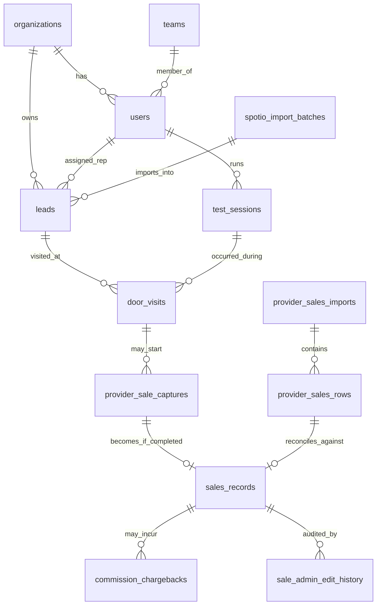

# Field Coach — Live Database Schema Reference

**Generated:** 2026-09-14, via direct introspection of the live Supabase project (`athxxrfqxwlfnuvbqadp`) — not reconstructed from migration files.

## Why this document exists

The repository contains 106 migration files (Aug 20 – Sep 11, 2026), but migration history only accounts for **35 of the 94 tables** in the live database. The remaining **59 tables — including foundational ones like `users`, `leads`, `sales_records`, `door_visits`, `test_sessions`, and `organizations`** — were created before migration tracking began (almost certainly directly via the Supabase dashboard/SQL editor) and have **no corresponding creation script anywhere in version control**.

**Practical implication:** if this Supabase project were ever lost, corrupted, or needed to be re-created (new environment, disaster recovery, cloning for a second organization), the current repository alone could not rebuild the schema. This document is a stopgap — the real fix is generating a proper baseline migration (see recommendation at the end).

**On the "Purpose" column below:** plain text is copied verbatim from an actual comment already stored on that table in the live database (these were clearly authored deliberately — good practice, just not visible from the repo alone). *Italicized text* is inferred by reading the table's columns and foreign keys, not an authoritative source — verify before relying on it for anything load-bearing.

## At a glance

- **94 tables total**, all with Row Level Security enabled (good — no exceptions found)
- **59 tables predate migration tracking** (63%)
- **1 explicitly legacy table still live:** `manager_override_controls_legacy_20260820` — superseded by `manager_override_controls`; confirm nothing still reads it, then drop
- Largest tables by row count: `spotio_import_items` (114,761 rows — raw staging data, consider archiving old batches), `leads` (71,275), `lead_removal_audit` (34,468), `test_events` (25,120)

## Identity & Organization

| Table | Rows | Tracked in migrations? | Purpose |
|---|---|---|---|
| `organizations` | 1 | ⚠️ predates history | *Root tenant/company record; billing_status and active flag gate access org-wide.* |
| `organization_memberships` | 15 | ⚠️ predates history | *Join table linking auth users to organizations with a role (owner/admin/manager/trainer/rep/tester/billing_admin).* |
| `organization_subscriptions` | 1 | ⚠️ predates history | *Billing/subscription state per organization (Stripe/Apple/Google/manual), plan, seat limit, period dates.* |
| `organization_entitlements` | 9 | ⚠️ predates history | *Per-organization feature flags/limits (entitlement_key + enabled + limit_value) — likely the paywall/entitlement backbone.* |
| `users` | 18 | ⚠️ predates history | *Core rep/manager/admin profile, linked 1:1 to Supabase auth.users via auth_user_id; carries role, team, org.* |
| `app_user_access` | 16 | ⚠️ predates history | *Email-keyed access/role table used by edge functions as the primary authorization check; carries manager/admin assignment chain.* |
| `teams` | 7 | ⚠️ predates history | *Sales team grouping, each with a manager_user_id and org.* |
| `territories` | 0 | ⚠️ predates history | *Named geographic sales territory, optionally tied to a provider/market and assigned team.* |
| `pending_named_role_designations` | 1 | ⚠️ predates history | Pre-designates a requested signup role by name but never grants access without Admin verification of the actual email. |
| `rep_access_requests` | 7 | ⚠️ predates history | *Pending signup/access requests awaiting Admin approval (requested_role, requested_team, status).* |

## Leads & Assignment

| Table | Rows | Tracked in migrations? | Purpose |
|---|---|---|---|
| `leads` | 71,275 | ⚠️ predates history | *Core lead/prospect record: address, geocoding, disposition/stage, assignment (rep/manager/admin), dedup/source-tracking metadata from imports.* |
| `lead_assignment_history` | 0 | ⚠️ predates history | *Audit trail of lead reassignment between reps/teams.* |
| `lead_source_aliases` | 4,809 | ⚠️ predates history | *Maps external source-system identifiers/addresses to canonical lead IDs, for import dedup.* |
| `lead_import_identity_conflicts` | 0 | ⚠️ predates history | *Queue of import rows that couldn't be auto-matched/merged into an existing lead, pending resolution.* |
| `lead_source_merge_history` | 0 | ⚠️ predates history | *Audit of how incoming import rows were merged (created/updated/unchanged/restored) into leads.* |
| `lead_geocode_verifications` | 770 | ✅ | Server-only audit of Google Maps geocoding comparisons and pin-placement decisions. |
| `lead_contact_edit_history` | 20 | ✅ | Immutable audit trail for organization-scoped lead customer-name, phone, notes, and field-created address changes. |
| `lead_removal_audit` | 34,468 | ✅ | Private immutable audit of reversible lead-list removals, including actor, reason, canonical duplicate, and original lead snapshot. |

## Field Sessions, Door Visits & Location

| Table | Rows | Tracked in migrations? | Purpose |
|---|---|---|---|
| `field_sessions` | 0 | ⚠️ predates history | *Earlier/simpler session table (rep, territory, start/end + GPS). 0 rows — appears superseded by test_sessions; confirm and consider dropping.* |
| `test_sessions` | 246 | ⚠️ predates history | *The actual authoritative field-session table despite the name (tester_name column even defaults to a specific person) — start/end, device/app version, per-rep workday timezone.* |
| `test_events` | 25,120 | ⚠️ predates history | *Fine-grained event stream per session (breadcrumbs, arrivals, dispositions) with GPS quality metadata. Large table (25k rows).* |
| `door_visits` | 145 | ⚠️ predates history | Authoritative door-visit audit. session_id uses the same authenticated test_sessions field-session lifecycle validated by the door workflow RPCs. Location verification remains coaching-only. |
| `door_activities` | 0 | ⚠️ predates history | *Earlier/simpler door-disposition table. 0 rows — appears superseded by door_visits.* |
| `location_events` | 0 | ⚠️ predates history | *Earlier/simpler GPS breadcrumb table tied to field_sessions. 0 rows — appears superseded by test_events.* |
| `native_location_sessions` | 0 | ⚠️ predates history | *Tracks native-app (Capacitor) background location session tokens, separate from the web session flow.* |
| `field_session_auto_closures` | 132 | ✅ |  |
| `field_area_assignments` | 0 | ⚠️ predates history | *Per-user assigned working-area geofence (center point + radius) used for outside-area session auto-stop.* |
| `sph_rep_settings` | 14 | ✅ | *Per-rep 'Sales Per Hour' home-base location and workday timezone settings.* |
| `sph_presence_events` | 3,318 | ✅ | *Login/heartbeat/sale/field-start/end event stream used to compute rep presence relative to home base and assigned area.* |
| `sph_home_setting_audit` | 19 | ✅ |  |
| `observed_door_models` | 9 | ⚠️ predates history | *Learned/observed door GPS coordinates and walkway offsets per lead, likely for GPS-placement coaching accuracy.* |
| `session_control_rules` | 0 | ⚠️ predates history | *Global tunable thresholds for session auto-stop (outside-area distance/grace period, stationary radius, idle timeouts).* |
| `field_analytics_results` | 174 | ⚠️ predates history | *Cached/generated analytics summary per session (engine_version + JSON summary).* |

## Sales, Commission & Ranking

| Table | Rows | Tracked in migrations? | Purpose |
|---|---|---|---|
| `sales_records` | 166 | ⚠️ predates history | *The core sale record: rep, customer, ISP/product details, verification status, ranking eligibility, full compensation_snapshot JSON.* |
| `sales_feed` | 39 | ⚠️ predates history | *Public/celebration-facing feed of sales (customer/order details deliberately excluded) for the live-wins UI.* |
| `commission_chargebacks` | 0 | ✅ |  |
| `commission_chargeback_allocations` | 0 | ✅ |  |
| `compensation_rules` | 0 | ⚠️ predates history | *Versioned JSON commission rule sets, keyed by rule_key, with an active flag.* |
| `compensation_admin_settings` | 0 | ⚠️ predates history | *Singleton toggle for whether manager commission overrides are enabled org-wide.* |
| `manager_compensation_settings` | 0 | ⚠️ predates history | *Per-manager toggle for whether commission overrides apply.* |
| `manager_override_controls` | 1 | ✅ | *Per-manager override-enabled flag (current version).* |
| `manager_override_controls_legacy_20260820` | 0 | ⚠️ predates history | *Superseded predecessor of manager_override_controls. 0 rows — safe cleanup candidate.* |
| `manager_override_authority_changes` | 0 | ✅ |  |
| `rep_override_controls` | 0 | ⚠️ predates history | *Per-rep override-enabled flag, mirroring manager_override_controls at the rep level.* |
| `sale_admin_edit_history` | 468 | ⚠️ predates history | *Audit of every Admin edit/approval/return-to-review action on a sale, with before/after JSON snapshots (468 rows — heavily used).* |
| `sale_admin_review_transactions` | 0 | ✅ |  |
| `sale_credit_assignment_history` | 29 | ✅ |  |
| `sale_credit_review_queue_history` | 65 | ✅ |  |
| `sale_incomplete_evidence_history` | 4 | ✅ |  |
| `sale_ranking_credit_history` | 37 | ✅ |  |
| `sale_rep_detail_history` | 8 | ✅ |  |
| `sale_review_disposition_history` | 151 | ✅ |  |
| `sale_deletion_audit` | 23 | ⚠️ predates history | *Snapshot of a sale record captured before an Admin deletes it, for recovery/audit.* |
| `sale_order_photos` | 16 | ✅ |  |
| `sale_order_photo_pilot_samples` | 0 | ✅ | Admin-only 30-50 screenshot pilot. Stores redaction attestations, suggestion-only extraction, independently entered ground truth, and server-computed field accuracy. |
| `provider_sale_capture_photos` | 11 | ⚠️ predates history | Short-lived private order photos staged against a signed-in user provider capture. On COMPLETE SALE they are moved into sale_order_photos; ABANDONED deletes them. |
| `ghost_ranking_settings` | 1 | ✅ | *Configuration for a synthetic 'Ghost' benchmark account used to set ranking goals — email is hardcoded via a CHECK constraint.* |
| `ghost_ranking_setting_changes` | 5 | ✅ | *Audit of changes to ghost_ranking_settings.* |
| `metrics_visibility_settings` | 0 | ⚠️ predates history | *Global toggles for whether rep/manager metrics are visible.* |
| `rep_metrics_visibility` | 14 | ⚠️ predates history | *Per-rep override of metrics visibility.* |

## Provider Integration & Reconciliation

| Table | Rows | Tracked in migrations? | Purpose |
|---|---|---|---|
| `provider_sales_imports` | 9 | ⚠️ predates history | *One row per uploaded provider report (CSV/HTML/XML), rep-account or dealer-account scope, with period dates and a dedup file hash.* |
| `provider_sales_rows` | 386 | ⚠️ predates history | *Individual parsed order rows from a provider report; materialization_status describes how it was matched/turned into a sales_records row.* |
| `provider_seller_links` | 12 | ⚠️ predates history | *Maps a rep to their known seller identifier(s) per provider, used to match provider report rows back to the correct rep.* |
| `provider_corporate_access` | 5 | ✅ | Internal allowlist for importing authoritative corporate provider reports. Provider identities never grant McCoy app roles. |
| `provider_sale_captures` | 254 | ✅ | Durable record that a rep opened or attempted to open an external provider dashboard while processing a McCoy sale. Captures do not count for ranking or pay until linked to an ISP-verified sales_records row. |
| `provider_identity_owner_controls` | 1 | ⚠️ predates history | Admin-only atomic ownership switch for provider seller identities. Target must already be an active McCoy Admin. |
| `provider_identity_owner_history` | 0 | ⚠️ predates history | *Audit of ownership changes in provider_identity_owner_controls.* |
| `global_provider_identity_links` | 3 | ✅ | *Organization-wide mapping from a provider identity key to the rep it belongs to.* |
| `provider_seller_assignment_history` | 0 | ✅ | Immutable audit log of Admin assignments from unmatched ISP seller identities to active McCoy users. |
| `provider_sale_evidence_review_history` | 54 | ✅ | *Audit of Admin decisions (approved/unverified/not-a-sale/restore) on ambiguous provider evidence rows.* |
| `sale_provider_reconciliation_history` | 0 | ✅ |  |

## SPOTIO Lead Import Pipeline

| Table | Rows | Tracked in migrations? | Purpose |
|---|---|---|---|
| `spotio_connection_status` | 0 | ⚠️ predates history | *Singleton row tracking SPOTIO API connection/sync status and last error.* |
| `spotio_import_batches` | 36 | ⚠️ predates history | *One row per SPOTIO lead-import upload, with per-batch created/updated/collision/quarantined counts.* |
| `spotio_import_items` | 114,761 | ⚠️ predates history | *Raw individual lead payloads from a SPOTIO batch before normalization. By far the largest table (114,761 rows) — pure staging data.* |
| `spotio_import_results` | 4,798 | ⚠️ predates history | *Per-row outcome (created/updated/unchanged/collision/quarantined/archived) of processing a SPOTIO import batch.* |
| `spotio_import_normalized_rows` | 0 | ⚠️ predates history | *Normalized intermediate form of SPOTIO rows prior to merge into leads.* |
| `spotio_recovery_runs` | 1 | ⚠️ predates history | *A recovery pipeline run for re-processing/recovering SPOTIO data — matches the 'temporary-spotio-recovery-relay' GitHub workflow.* |
| `spotio_recovery_records` | 0 | ⚠️ predates history | *Individual records staged within a spotio_recovery_runs run.* |
| `spotio_recovery_payload_chunks` | 2 | ⚠️ predates history | *Chunked raw payload storage supporting the SPOTIO recovery pipeline.* |

## Admin, Access & Audit

| Table | Rows | Tracked in migrations? | Purpose |
|---|---|---|---|
| `secondary_admin_assignments` | 0 | ✅ | *Tracks a rep/manager/trainer temporarily granted secondary Admin privileges, with revocation support.* |
| `user_account_removal_history` | 3 | ✅ | Immutable Admin audit of McCoy access removal and Supabase Auth soft deletion; historical accounting identities remain referenced. |
| `user_display_name_changes` | 11 | ✅ | *Audit of display-name changes, including whether the change synced to Supabase Auth metadata.* |
| `accounting_access` | 0 | ⚠️ predates history | *Simple allowlist of emails granted accounting/audit access (separate from the admin role).* |
| `customer_list_access_log` | 1,659 | ✅ | *Logs every view/export of the Customer List, with record count and filters — itself an access audit.* |
| `privacy_acceptances` | 23 | ⚠️ predates history | *Records user acceptance of a privacy notice version, including location/analytics consent flags.* |
| `accounting_file_deliveries` | 4 | ✅ | *Tracks generated accounting export files (download/email/OneDrive), delivery status, and a content hash.* |

## Auth Email Delivery

| Table | Rows | Tracked in migrations? | Purpose |
|---|---|---|---|
| `auth_email_provider_settings` | 1 | ✅ | Non-secret production mail readiness state. SMTP credentials remain in managed secret stores. |
| `auth_email_delivery_events` | 41 | ✅ | Auditable Auth email requests and provider delivery events. Provider webhook IDs plus recipients make ingestion idempotent. |

## Dev Tools / Misc Integrations

| Table | Rows | Tracked in migrations? | Purpose |
|---|---|---|---|
| `mccoy_dev_queue` | 0 | ⚠️ predates history | *A build/test request queue — a lightweight internal ticket system (draft to ready_for_test to approved_to_build to deployed), apparently SMS-driven.* |
| `mccoy_sms_audit` | 0 | ⚠️ predates history | *Inbound/outbound SMS log linked to mccoy_dev_queue — matches the Twilio SMS-command integration in api/sms-command.mjs.* |
| `apple_notes_connections` | 1 | ⚠️ predates history | *Per-user Apple Notes sync connection/token state.* |
| `apple_notes_folder_allowlist` | 1 | ⚠️ predates history | Only folders explicitly authorized by an administrator may be accepted by Apple Notes sync. |
| `apple_notes_documents` | 0 | ⚠️ predates history | Notes received only from an explicitly authorized Apple Notes folder via the secured sync function. |
| `app_config` | 0 | ⚠️ predates history | *Generic key-value app configuration store.* |

## Core relationships (simplified)

This covers the primary flow: **org → rep → lead → door visit → provider sale capture → sales record → commission**, plus the SPOTIO import pipeline that populates `leads`. It intentionally omits ~150 foreign keys across audit/history tables for readability — those are all recorded in `supabase-schema-raw.json` (included alongside this file) for tooling or a fuller diagram if needed.

## Recommendations

1. **Generate a real baseline migration.** Run `supabase db dump --schema public -f supabase/migrations/00000000000000_baseline.sql` (or equivalent) against the live project once, so the 59 untracked tables finally have a version-controlled creation script. Do this before any further schema changes.
2. **Drop `manager_override_controls_legacy_20260820`** after confirming no code path reads it (a quick grep across `app-*.js` and `supabase/functions/` for that exact table name will confirm).
3. **Consider archiving `spotio_import_items`** (114,761 rows of raw staging JSON) older than N days/months — it's raw intermediate data from lead imports, not something the app queries live, based on its role in the import pipeline.
4. Keep this document updated by re-running the introspection periodically, or better, wire step 1's dump into CI so schema drift is caught automatically.